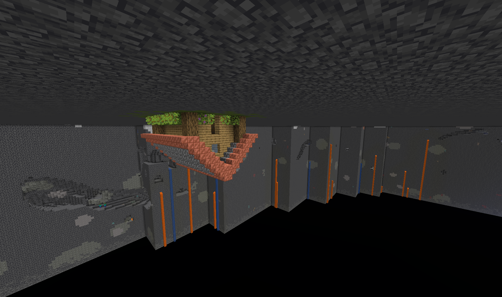
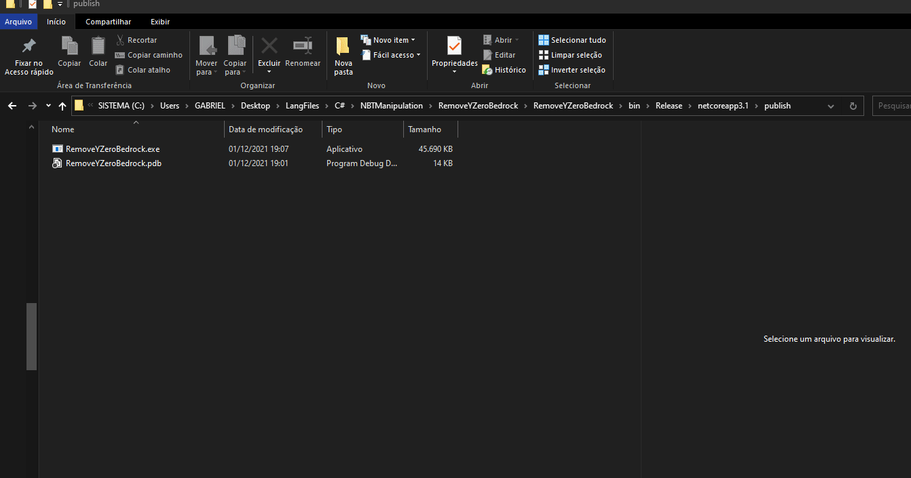
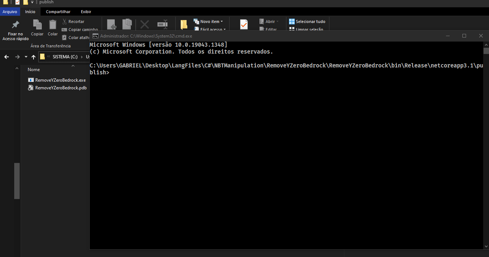

# BedrockRemover

If you would like to maintain the negative coordinates of your Minecraft world unaltered(void) when updating from 1.17 to 1.18, this is the solution
----

## Why?

Well, if you are still reading this, you probably already know that
Minecraft is updating to 1.18, and that in this update the world height will be 
expanded, both positively and negatively, going all  the way down to Y = -64 (previously, in 1.17 and before, it only went to 0). 
Because of that change, to make old worlds compatible with this version, 
Mojang took the decision of simply filling the negative part of the world with 
new terrain. Now, that solution works really great for a lot of cases, but there
are some cases in which you might like not having this new terrain but have only void.
e.g. Slime farms. These would be significantly affected by new terrain under then 
since other mobs, including Slime could spawn on it. Of course it is possible to 
solve this specific issue by just AFKing very heigh up in the sky, but sometimes
that solutions isn't the best. Another case for having void there is for building.
With all of that void you can still build there, making a kind of cave skyblock 
in your own world. Anyways, there are infinite reason for doing this.

----------

## How it works and how to use it

The principle behind this app is really simple: Mojang made so that when updating,
the world generator would not place new blocks in the negative Y area, if the Y0 
bedrock was absent. Therefore, to make so that the negative area of the wolrd is 
all void, all that need to be done is to remove the bedrock at Y0.

The easiest way to do that is to actually remove all of the bedrock of the chunk
desired to be intended with void. This is all that this code does. It access
the chunk data of a Minecraft save and alters it so that bedrock becomes deepslate.

### How to use it

- First MAKE A BACKUP of your world. Please understand that I have only tested this code with my world in my machine, and I offer NO warranty that it will work trouble free. It should, but I don't guarantee it will
- Now that you have already made a backup, download the binary file(.exe)(still not available, clone the project and run it) and execute it
- When the terminal shows up, simply copy and paste your save directory, so something like %appdata%/Roaming/.minecraft/saves/MyWorld (do not put %appdata%, the program will give an error, use the actual path of %appdata%)
   
  
- After inserting the world save at the terminal simply press enter, and the code will run

### Notes:
If you would like to convert just a certain area of the world, do NOT simply run the file. For this case you will need to run the program from another terminal:
First, in the installation directory, click on the directory path and typ "cmd".

With the terminal open type 
```
RemoveYZeroBedrock.exe xMin zMin xMax zMax
```
Substituting the xMin, zMin, xMax and zMax by the coordinates of your world that you want to remove the bedrock. The program will remove all bedrock in the square(area) defined by those chunks.


-----
this program is designed to be time efficient, it is designed to run as fast as possibl.
Because of that, it removes the bedrock in parallel, which means faster speed, but also means
that the program needs to load the entire Minecraft map provided at once. Therefore
this program uses A LOT of memory. More than chrome. Don't be scared if you see it using more than one gigabyte of memory, Minecraft does too.

---
### Final considerations

- This program will remove only bedrock at the last subchunk, so, bedrock that is lower than Y = 16
- This program works on a chunk by chunk bases. It won't make a smooth transition and won't delete half a chunk of bedrock, only the entire bedrock of the chunk.
